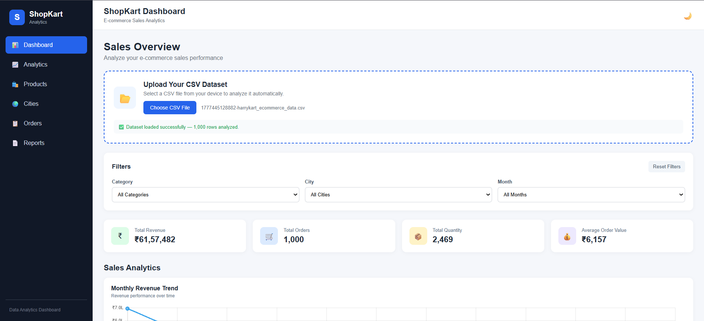
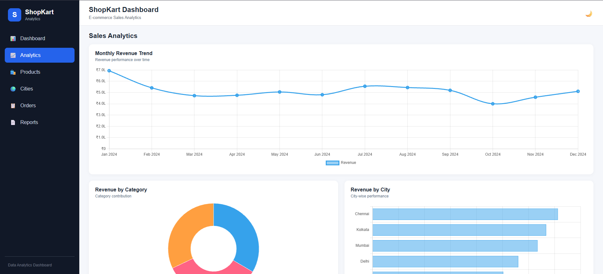
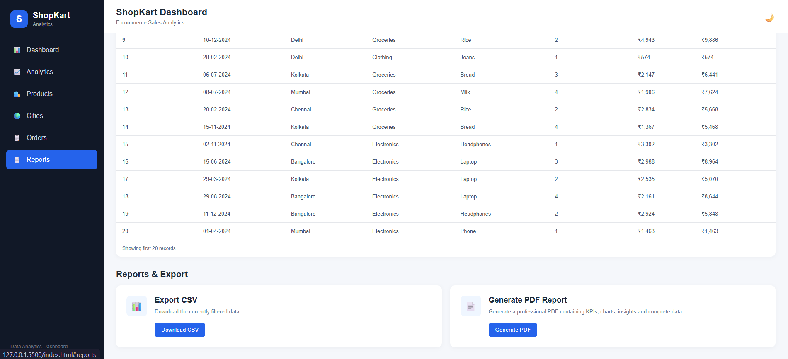
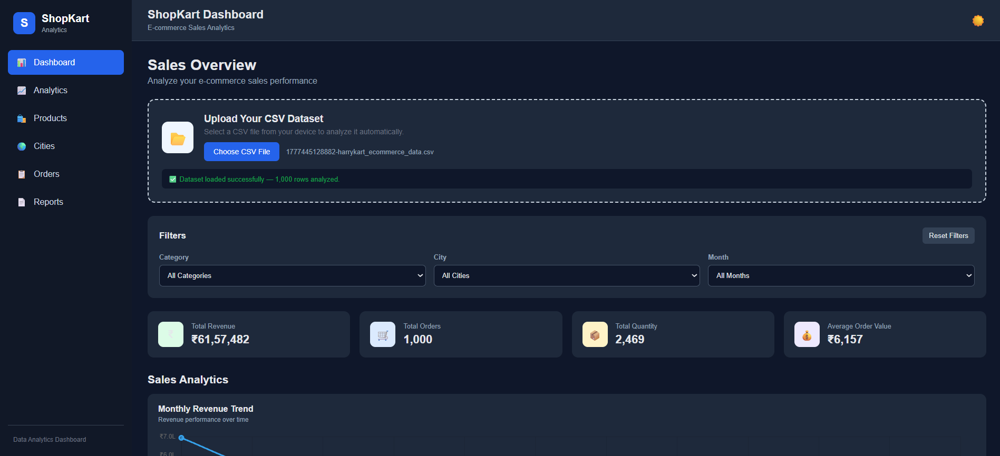

# ShopKart

# 🛒 ShopSight Analytics – E-commerce Sales Analytics Dashboard

**ShopSight Analytics** is an interactive **E-commerce Sales Analytics Dashboard** built to analyze sales performance and generate meaningful business insights from e-commerce order data.

The dashboard helps users understand **revenue trends, product performance, category performance, and city-wise sales** through interactive charts, KPIs, filters, and automated insights.

---

## 📊 Project Overview

E-commerce businesses generate large amounts of sales data every day. Analyzing this data manually can make it difficult to identify important trends and business opportunities.

ShopSight Analytics provides an interactive dashboard where users can upload a CSV dataset and instantly explore:

* 💰 Total Revenue
* 🛍️ Total Orders
* 📦 Total Quantity Sold
* 📈 Average Order Value
* 📅 Monthly Revenue Trends
* 🏷️ Category-wise Revenue
* 🏙️ City-wise Revenue
* ⭐ Top 10 Products
* 📋 Detailed Order Data
* 💡 Automatic Business Insights

---

## 🖥️ Dashboard Screenshots

### 📊 Dashboard Overview



The main dashboard provides an overview of revenue, orders, quantity sold, average order value, filters, and monthly sales performance.

---

### 📈 Sales Analytics



The analytics section provides interactive visualizations for monthly revenue trends, category-wise revenue, and city-wise sales performance.

---

### 📋 Reports & Export



The reports section allows users to view detailed order information, export filtered data as CSV, and generate a professional PDF report.

---

### 🌙 Dark Mode



The dashboard also supports dark mode for a comfortable viewing experience.

---

## 🎯 Project Objectives

The main objectives of this project are:

1. Analyze overall e-commerce sales performance.
2. Identify monthly revenue trends.
3. Compare revenue across product categories.
4. Analyze city-wise sales performance.
5. Identify top-performing products.
6. Provide interactive filtering for better analysis.
7. Generate automatic business insights.
8. Allow users to export filtered data.
9. Generate professional PDF reports.
10. Build a portfolio-ready Data Analytics project.

---

## 🗂️ Dataset

The dashboard works with a CSV-based e-commerce dataset.

### Dataset Columns

| Column     | Description             |
| ---------- | ----------------------- |
| `OrderID`  | Unique order identifier |
| `Date`     | Order date              |
| `City`     | Customer/order city     |
| `Category` | Product category        |
| `Product`  | Product name            |
| `Quantity` | Number of units sold    |
| `Price`    | Price per unit          |
| `Revenue`  | Total revenue generated |

### Dataset Size

* **1,000 orders**
* Multiple cities
* Multiple product categories
* Multiple products
* Sales data across different months

---

## 🚀 Key Features

### 1. 📌 KPI Dashboard

The dashboard provides four important KPIs:

* **Total Revenue**
* **Total Orders**
* **Total Quantity Sold**
* **Average Order Value**

---

### 2. 📈 Monthly Revenue Trend

An interactive line chart displays revenue across different months.

This helps identify:

* High-revenue months
* Low-revenue months
* Seasonal patterns
* Changes in sales performance

---

### 3. 🏷️ Revenue by Category

A doughnut chart shows the contribution of each product category to total revenue.

Users can easily compare category performance.

---

### 4. 🏙️ Revenue by City

A bar chart displays revenue generated from different cities.

This helps identify important sales markets and geographical performance.

---

### 5. ⭐ Top 10 Products

The dashboard automatically identifies the top 10 products based on revenue.

This helps businesses understand which products contribute most to sales.

---

### 6. 🔎 Interactive Filters

Users can filter the dashboard by:

* Category
* City
* Month

All KPIs, charts, insights, and the order table update automatically based on the selected filters.

---

### 7. 📋 Order Details Table

The dashboard provides a detailed table containing order-level information such as:

* Order ID
* Date
* City
* Category
* Product
* Quantity
* Price
* Revenue

---

### 8. 💡 Automatic Business Insights

ShopSight Analytics automatically generates insights from the filtered data.

For example:

* Highest revenue month
* Top-performing category
* Top-performing city
* Best-performing product
* Total revenue and order summary

---

### 9. 📥 CSV Upload

Users can upload their own CSV file directly through the dashboard.

The project uses **Papa Parse** to read and process CSV data in the browser.

This makes the dashboard reusable with different e-commerce datasets.

---

### 10. 📊 Data Export

Users can export the currently filtered data as a CSV file.

---

### 11. 📄 PDF Report

The dashboard can generate a professional PDF report containing:

* Dashboard KPIs
* Revenue chart
* Category analysis
* City analysis
* Product analysis
* Business insights
* Filtered order details

---

### 12. 🌙 Dark Mode

A dark mode option is included for a better viewing experience.

---

### 13. 📱 Responsive Design

The dashboard is designed to work across:

* 💻 Desktop
* 💻 Laptop
* 📱 Mobile
* 📟 Tablet

---

## 🛠️ Technologies Used

| Technology          | Purpose                             |
| ------------------- | ----------------------------------- |
| **HTML5**           | Dashboard structure                 |
| **CSS3**            | Styling and responsive design       |
| **JavaScript**      | Data processing and dashboard logic |
| **Chart.js**        | Interactive charts                  |
| **Papa Parse**      | CSV data processing                 |
| **jsPDF**           | PDF generation                      |
| **jsPDF AutoTable** | PDF table generation                |

---

## 📁 Project Structure

```text
ShopSight-Analytics/
│
├── index.html
├── style.css
├── script.js
├── harrykart_ecommerce_data.csv
├── README.md
│
└── assets/
    ├── dashboard-overview.png
    ├── analytics.png
    ├── reports.png
    └── dark-mode.png
```

---

## ⚙️ How to Run the Project

### Run Locally

1. Clone the repository:

```bash
git clone https://github.com/yourusername/shopsight-analytics.git
```

2. Open the project folder in **VS Code**.

3. Install the **Live Server** extension.

4. Right-click `index.html`.

5. Select:

```text
Open with Live Server
```

6. Open the dashboard in your browser.

7. Click **Upload CSV** and select:

```text
harrykart_ecommerce_data.csv
```

---

## 📊 Dashboard Workflow

```text
CSV Dataset
     ↓
CSV Upload
     ↓
Data Processing
     ↓
Filtering
     ↓
KPI Calculation
     ↓
Chart Generation
     ↓
Business Insights
     ↓
CSV / PDF Export
```

---

## 📌 Business Questions Answered

ShopSight Analytics can help answer questions such as:

1. What is the total revenue?
2. How many orders were placed?
3. How many products were sold?
4. What is the average order value?
5. Which month generated the highest revenue?
6. Which category generates the most revenue?
7. Which city generates the most revenue?
8. Which products are the top revenue generators?
9. How does revenue change over time?
10. How does performance change after applying filters?

---

## 💼 Skills Demonstrated

This project demonstrates practical skills in:

* Data Analysis
* Data Cleaning
* Data Transformation
* JavaScript
* Data Visualization
* KPI Development
* Business Intelligence
* Interactive Dashboard Development
* CSV Data Processing
* Business Insights Generation
* Data Export
* Report Generation
* Responsive Web Design

---

## 🔮 Future Improvements

Possible future improvements include:

* Customer segmentation
* Profit and margin analysis
* Sales forecasting
* Customer lifetime value
* Repeat customer analysis
* Geographic maps
* Advanced product analysis
* Year-over-year comparison
* Database integration
* Power BI version of the dashboard
* Backend API integration

---

## 👨‍💻 Author

**Vivek Kumar**

Aspiring Data Analyst | Data Analytics | SQL | Python | JavaScript | Data Visualization

---

## ⭐ Project Highlights

> **ShopSight Analytics transforms raw e-commerce data into an interactive business intelligence dashboard that helps users understand sales performance and discover meaningful business insights.**

If you find this project useful, consider giving the repository a ⭐ on GitHub.
